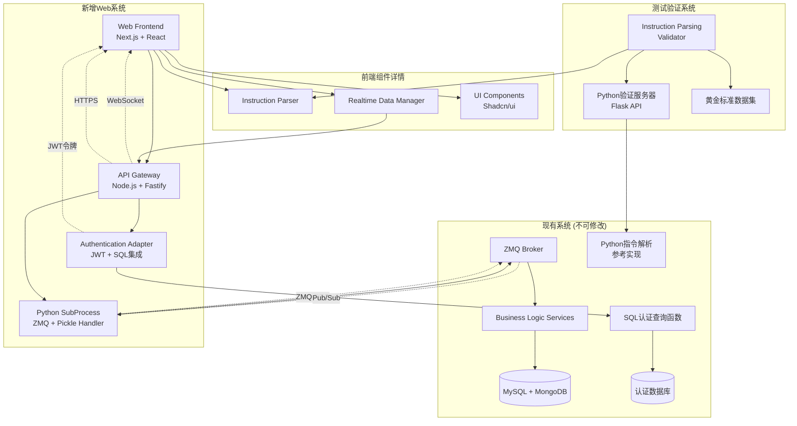

# Component Architecture

### New Components

### ApiGateway

**Responsibility:** 协议翻译和中间层服务，将Web请求转换为ZMQ调用，实现实时数据推送
**Integration Points:** 现有ZMQ Broker、Web前端、认证系统

**Key Interfaces:**

- HTTP REST API - 处理前端的请求/响应操作
- WebSocket API - 实时数据推送和订阅管理
- ZMQ Client - 与现有后端系统的RPC通信
- Python子进程接口 - 处理pickle序列化和ZMQ协议细节

**Dependencies:**

- **Existing Components:** ZMQ Broker, Authentication Service, Business Logic Services
- **New Components:** WebFrontend (消费API)

**Technology Stack:** Node.js + Fastify + Socket.IO + python-shell + ZMQ bindings

### WebFrontend

**Responsibility:** 现代化Web用户界面，提供指令输入、账户监控、算法跟踪等完整交易功能
**Integration Points:** API网关、浏览器通知系统、本地存储

**Key Interfaces:**

- React组件API - 模块化的UI组件系统
- HTTP Client - 与API网关的REST通信
- WebSocket Client - 实时数据订阅和更新
- 浏览器API - 通知、音频、本地存储

**Dependencies:**

- **Existing Components:** 无直接依赖，通过API网关间接集成
- **New Components:** ApiGateway (数据和服务提供者)

**Technology Stack:** Next.js + React + TypeScript + Shadcn/ui + Zustand + Socket.IO Client

### InstructionParser

**Responsibility:** 前端指令解析引擎，与Python参考实现保持100%逻辑一致性
**Integration Points:** Web前端指令输入组件、API网关验证层

**Key Interfaces:**

- 解析API - 将自然语言指令转换为标准化格式
- 验证API - 指令语法和语义验证
- 预览API - 实时解析结果预览

**Dependencies:**

- **Existing Components:** 基于Python参考实现逻辑
- **New Components:** WebFrontend (解析引擎使用者)

**Technology Stack:** TypeScript + 正则表达式引擎 + Jest测试框架

### RealtimeDataManager

**Responsibility:** 管理WebSocket连接和实时数据流，确保数据同步和连接可靠性
**Integration Points:** API网关WebSocket服务、前端状态管理、断线重连机制

**Key Interfaces:**

- 连接管理API - WebSocket连接生命周期管理
- 订阅管理API - 数据主题的订阅和取消订阅
- 数据分发API - 将实时数据分发给相关组件

**Dependencies:**

- **Existing Components:** 后端Pub/Sub系统（通过API网关）
- **New Components:** WebFrontend组件（数据消费者）

**Technology Stack:** Socket.IO Client + TypeScript + 重连逻辑

### InstructionParsingValidator

**Responsibility:** 指令解析一致性验证服务，确保TypeScript与Python实现的100%逻辑一致性
**Integration Points:** 开发测试环境、CI/CD流程、Python参考实现

**Key Interfaces:**

- Python验证服务器 - 基于Flask的HTTP API，调用原始Python解析函数
- 自动化测试框架 - Jest测试套件，执行对照验证
- 黄金标准数据集 - 包含所有指令类型的标准测试用例
- CI/CD集成脚本 - 自动化一致性验证流程

**Dependencies:**

- **Existing Components:** Python指令解析参考实现（docs/appendices/instructions/）
- **New Components:** InstructionParser (验证目标)

**Technology Stack:** Flask + Jest + Python + TypeScript + 自动化脚本

### AuthenticationAdapter

**Responsibility:** 认证系统适配器，集成现有SQL查询认证函数与新的JWT令牌机制
**Integration Points:** 现有认证数据库、API网关中间件、前端认证状态

**Key Interfaces:**

- SQL查询接口 - 调用现有认证验证函数
- JWT令牌管理 - 生成和验证访问令牌
- 会话管理API - 处理用户登录状态和权限
- 中间件集成 - API网关的认证中间件

**Dependencies:**

- **Existing Components:** 现有SQL认证查询函数
- **New Components:** ApiGateway (认证中间件宿主)

**Technology Stack:** Node.js + JWT + SQL连接库 + 认证中间件

### Component Interaction Diagram


