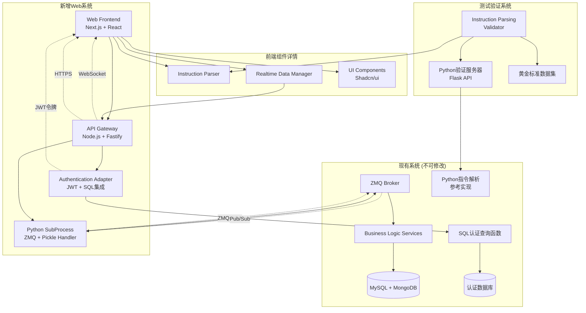

# 期权交易系统 Web 端棕地增强架构文档

## Introduction

本文档为期权交易系统Web端棕地增强项目提供全面的技术架构设计。主要目标是为现有的Python/vnpy分布式后端系统构建一个全新的、高性能的Web前端，同时确保不对现有后端服务进行任何修改。本文档将作为AI驱动开发的权威技术指南。

**Relationship to Existing Architecture:**
本文档补充现有项目架构，定义新组件如何与当前系统无缝集成。当新旧模式存在冲突时，本文档提供保持一致性的指导原则，同时确保增强功能的成功实施。

### Existing Project Analysis

基于对现有项目文档、代码结构和业务逻辑的深入分析，我识别出以下关键系统特征：

**Current Project State:**

- **Primary Purpose:** 成熟的Python期权交易系统，支持复杂的算法交易、实时指令解析和多账户管理
- **Current Tech Stack:** Python 3.10 + vnpy框架 + ZeroMQ Majordomo RPC + MySQL/MongoDB
- **Architecture Style:** 分布式微服务架构，采用RPC通信和Pub/Sub实时数据推送
- **Deployment Method:** 生产环境分布式部署，桌面客户端直连ZMQ broker

**Available Documentation:**

- 完整的PRD和架构文档，包含技术约束和集成需求
- ZMQ Majordomo协议完整实现（docs/appendices/rpc/mdp/）
- 4种核心指令类型的Python参考实现（docs/appendices/instructions/）
- 现有技术栈和数据库架构详细说明

**Identified Constraints:**

- **绝对约束**: 现有后端系统、业务逻辑、数据库结构零修改
- **协议约束**: 必须完全兼容ZMQ Majordomo RPC和Python pickle序列化
- **性能约束**: Web应用性能必须达到或超越现有桌面应用
- **安全约束**: 所有Web通信必须使用HTTPS/WSS加密

### Change Log

| Change | Date | Version | Description | Author |
| ------ | ---- | ------- | ----------- | ------ |
| 初始创建 | 2025-06-20 | 1.0 | 基于棕地PRD创建架构文档 | Winston (Architect) |
| PO验证更新 | 2025-06-20 | 1.1 | 基于PO验证反馈，补充认证集成方案和指令解析一致性验证架构 | Winston (Architect) |

## Enhancement Scope and Integration Strategy

### Enhancement Overview

**Enhancement Type:** 新功能添加 - 全新Web前端界面 + API网关集成层
**Scope:** 完整复刻现有桌面应用的核心功能，包括指令解析、账户监控、算法跟踪和实时通知
**Integration Impact:** 零影响 - 完全解耦的新增组件，通过API网关实现协议适配

### Integration Approach

**Code Integration Strategy:** 独立Monorepo架构，与现有Python代码库完全分离，确保零代码污染和冲突风险

**Database Integration:** 严格的服务层调用模式 - 新组件通过API网关调用现有后端服务获取数据，禁止直接数据库访问

**API Integration:** 混合通信模式 - HTTPS用于请求/响应操作，WebSocket用于实时数据推送，API网关负责与ZMQ协议的双向翻译

**UI Integration:** 基于Shadcn/ui的现代化组件库，保持与现有桌面应用的操作习惯一致性，采用React Grid Layout实现可配置仪表盘

### Compatibility Requirements

- **Existing API Compatibility:** API网关必须完全遵循ZMQ Majordomo协议规范，确保消息格式和序列化的100%兼容性
- **Database Schema Compatibility:** 零数据库修改，所有数据访问通过现有服务接口，确保数据一致性和业务逻辑完整性
- **UI/UX Consistency:** Web界面操作流程与现有桌面应用保持一致，降低用户学习成本和迁移风险
- **Performance Impact:** 指令解析<100ms，WebSocket延迟<50ms，整体响应速度达到或超越桌面应用

## Tech Stack Alignment

### Existing Technology Stack

| Category           | Current Technology | Version     | Usage in Enhancement | Notes     |
| :----------------- | :----------------- | :---------- | :------------------- | :-------- |
| **Language**       | Python             | 3.8+        | API网关Python子进程 | 后端主语言 |
| **Runtime**        | CPython            | 3.8+        | ZMQ协议处理         | 保持兼容性 |
| **Framework**      | vnpy               | Latest      | 通过API网关调用     | 交易核心框架 |
| **Database**       | MySQL + MongoDB    | Latest      | 服务层间接访问       | 混合存储架构 |
| **API Style**      | ZMQ RPC            | Latest      | API网关适配层       | 现有通信协议 |
| **Authentication** | 自定义认证          | N/A         | 保持现有机制        | 后端认证系统 |
| **Testing**        | Python unittest    | Built-in    | 集成测试验证        | 现有测试框架 |
| **Build Tool**     | Python setuptools  | Latest      | 无直接集成          | 后端构建工具 |

### New Technology Additions

| Technology   | Version     | Purpose     | Rationale     | Integration Method |
| :----------- | :---------- | :---------- | :------------ | :----------------- |
| Next.js      | 14+         | Web前端框架  | 现代化React框架，性能优异 | 独立前端应用 |
| TypeScript   | 5+          | 类型安全     | 金融应用要求强类型 | 前端开发语言 |
| Node.js      | LTS         | API网关运行时 | 高性能I/O处理 | 网关服务器 |
| Fastify      | Latest      | API网关框架  | 高性能Web框架 | HTTP/WebSocket服务 |
| Shadcn/ui    | Latest      | UI组件库     | 现代化设计系统 | 前端UI组件 |
| Zustand      | 4+          | 状态管理     | 轻量级状态管理 | 前端状态控制 |
| Socket.IO    | Latest      | 实时通信     | WebSocket可靠性 | 实时数据推送 |
| python-shell | Latest      | Python集成   | Node.js调用Python | ZMQ协议处理 |
| Flask        | Latest      | 测试服务器   | Python验证服务器 | 指令解析一致性验证 |

## Data Models and Schema Changes

### New Data Models

### InstructionDto

**Purpose:** 前端与API网关之间的指令传输对象
**Integration:** 基于现有Python指令解析逻辑，确保数据结构完全一致

**Key Attributes:**

- rawInput: string - 用户输入的原始指令文本
- parsedInstructions: Array<ParsedInstruction> - 解析后的标准化指令数组
- validationErrors: Array<ValidationError> - 解析过程中的错误信息
- timestamp: Date - 指令创建时间戳

**Relationships:**

- **With Existing:** 映射到现有Python指令解析引擎的输出格式
- **With New:** 关联OrderPreviewDto和AccountSelectionDto

### AccountStatusDto

**Purpose:** 虚拟账户状态的实时数据传输对象
**Integration:** 基于现有后端AccountData模型，通过ZMQ获取实时状态

**Key Attributes:**

- accountId: string - 账户唯一标识符
- accountName: string - 账户显示名称
- status: AccountStatus - 账户健康状态（正常/异常/离线）
- balance: number - 账户余额
- availableFunds: number - 可用资金
- riskRatio: number - 风险度百分比
- lastUpdate: Date - 最后更新时间

**Relationships:**

- **With Existing:** 直接映射现有AccountData数据结构
- **With New:** 用于AccountSelectionDto和OrderPreviewDto

### AlgorithmTaskDto

**Purpose:** 算法执行任务的监控数据传输对象
**Integration:** 聚合现有算法执行引擎的多个数据源

**Key Attributes:**

- portfolioId: string - 投资组合唯一标识
- taskName: string - 算法任务名称
- overallProgress: number - 总体执行进度（0-100）
- status: AlgorithmStatus - 任务状态（运行中/暂停/完成/错误）
- accountProgress: Array<AccountProgress> - 各账户执行进度
- startTime: Date - 任务开始时间
- estimatedCompletion: Date - 预计完成时间

**Relationships:**

- **With Existing:** 聚合现有算法执行数据和账户状态
- **With New:** 关联AccountStatusDto提供完整监控视图

### OrderPreviewDto

**Purpose:** 下单前的综合预览数据传输对象
**Integration:** 基于现有风险计算引擎和合约数据

**Key Attributes:**

- contractName: string - 合约名称
- direction: TradeDirection - 交易方向（买入/卖出）
- quantity: number - 交易数量
- price: number - 预计成交价格
- margin: number - 保证金要求
- greeks: GreeksData - 希腊值数据（Delta/Gamma/Theta/Vega）
- riskImpact: number - 风险影响评估
- estimatedPnL: number - 预期损益

**Relationships:**

- **With Existing:** 调用现有风险计算和定价引擎
- **With New:** 整合InstructionDto和AccountStatusDto数据

### Schema Integration Strategy

**Database Changes Required:**

- **New Tables:** 无 - 严格遵循零数据库修改原则
- **Modified Tables:** 无 - 所有现有表结构保持不变
- **New Indexes:** 无 - 不直接访问数据库
- **Migration Strategy:** 无需数据库迁移，所有数据通过现有服务API获取

**Backward Compatibility:**

- 100%向后兼容 - 新组件不影响现有数据访问模式
- 现有服务调用保持不变 - API网关作为额外客户端接入

## Component Architecture

### New Components

### ApiGateway

**Responsibility:** 协议翻译和中间层服务，将Web请求转换为ZMQ调用，实现实时数据推送
**Integration Points:** 现有ZMQ Broker、Web前端、认证系统

**Key Interfaces:**

- HTTP REST API - 处理前端的请求/响应操作
- WebSocket API - 实时数据推送和订阅管理
- ZMQ Client - 与现有后端系统的RPC通信
- Python子进程接口 - 处理pickle序列化和ZMQ协议细节

**Dependencies:**

- **Existing Components:** ZMQ Broker, Authentication Service, Business Logic Services
- **New Components:** WebFrontend (消费API)

**Technology Stack:** Node.js + Fastify + Socket.IO + python-shell + ZMQ bindings

### WebFrontend

**Responsibility:** 现代化Web用户界面，提供指令输入、账户监控、算法跟踪等完整交易功能
**Integration Points:** API网关、浏览器通知系统、本地存储

**Key Interfaces:**

- React组件API - 模块化的UI组件系统
- HTTP Client - 与API网关的REST通信
- WebSocket Client - 实时数据订阅和更新
- 浏览器API - 通知、音频、本地存储

**Dependencies:**

- **Existing Components:** 无直接依赖，通过API网关间接集成
- **New Components:** ApiGateway (数据和服务提供者)

**Technology Stack:** Next.js + React + TypeScript + Shadcn/ui + Zustand + Socket.IO Client

### InstructionParser

**Responsibility:** 前端指令解析引擎，与Python参考实现保持100%逻辑一致性
**Integration Points:** Web前端指令输入组件、API网关验证层

**Key Interfaces:**

- 解析API - 将自然语言指令转换为标准化格式
- 验证API - 指令语法和语义验证
- 预览API - 实时解析结果预览

**Dependencies:**

- **Existing Components:** 基于Python参考实现逻辑
- **New Components:** WebFrontend (解析引擎使用者)

**Technology Stack:** TypeScript + 正则表达式引擎 + Jest测试框架

### RealtimeDataManager

**Responsibility:** 管理WebSocket连接和实时数据流，确保数据同步和连接可靠性
**Integration Points:** API网关WebSocket服务、前端状态管理、断线重连机制

**Key Interfaces:**

- 连接管理API - WebSocket连接生命周期管理
- 订阅管理API - 数据主题的订阅和取消订阅
- 数据分发API - 将实时数据分发给相关组件

**Dependencies:**

- **Existing Components:** 后端Pub/Sub系统（通过API网关）
- **New Components:** WebFrontend组件（数据消费者）

**Technology Stack:** Socket.IO Client + TypeScript + 重连逻辑

### InstructionParsingValidator

**Responsibility:** 指令解析一致性验证服务，确保TypeScript与Python实现的100%逻辑一致性
**Integration Points:** 开发测试环境、CI/CD流程、Python参考实现

**Key Interfaces:**

- Python验证服务器 - 基于Flask的HTTP API，调用原始Python解析函数
- 自动化测试框架 - Jest测试套件，执行对照验证
- 黄金标准数据集 - 包含所有指令类型的标准测试用例
- CI/CD集成脚本 - 自动化一致性验证流程

**Dependencies:**

- **Existing Components:** Python指令解析参考实现（docs/appendices/instructions/）
- **New Components:** InstructionParser (验证目标)

**Technology Stack:** Flask + Jest + Python + TypeScript + 自动化脚本

### AuthenticationAdapter

**Responsibility:** 认证系统适配器，集成现有SQL查询认证函数与新的JWT令牌机制
**Integration Points:** 现有认证数据库、API网关中间件、前端认证状态

**Key Interfaces:**

- SQL查询接口 - 调用现有认证验证函数
- JWT令牌管理 - 生成和验证访问令牌
- 会话管理API - 处理用户登录状态和权限
- 中间件集成 - API网关的认证中间件

**Dependencies:**

- **Existing Components:** 现有SQL认证查询函数
- **New Components:** ApiGateway (认证中间件宿主)

**Technology Stack:** Node.js + JWT + SQL连接库 + 认证中间件

### Component Interaction Diagram



## API Design and Integration

### New API Endpoints

**API Integration Strategy:** 混合REST+WebSocket模式，REST处理请求/响应操作，WebSocket处理实时数据推送
**Authentication:** JWT令牌认证，与现有认证系统集成
**Versioning:** API版本控制(/api/v1/)，支持未来扩展

#### 用户认证端点

- **Method:** POST
- **Endpoint:** /api/v1/auth/login
- **Purpose:** 用户身份验证，获取JWT访问令牌
- **Integration:** 调用现有认证服务验证用户凭据

**Request:**

```json
{
  "username": "string",
  "password": "string",
  "remember": boolean
}
```

**Response:**

```json
{
  "success": boolean,
  "accessToken": "string",
  "refreshToken": "string",
  "expiresIn": number,
  "user": {
    "id": "string",
    "username": "string",
    "permissions": ["string"]
  }
}
```

#### 指令解析端点

- **Method:** POST
- **Endpoint:** /api/v1/instructions/parse
- **Purpose:** 解析自然语言交易指令，返回标准化格式
- **Integration:** 前端解析引擎预处理，后端Python引擎验证

**Request:**

```json
{
  "rawInstruction": "string",
  "selectedAccounts": ["string"],
  "validateOnly": boolean
}
```

**Response:**

```json
{
  "success": boolean,
  "parsedInstructions": [
    {
      "contractName": "string",
      "direction": "buy|sell",
      "quantity": number,
      "instrumentType": "call|put|vega",
      "month": "string"
    }
  ],
  "validationErrors": ["string"],
  "previewData": "OrderPreviewDto"
}
```

#### 订单提交端点

- **Method:** POST
- **Endpoint:** /api/v1/orders
- **Purpose:** 提交交易指令，创建算法任务
- **Integration:** 调用现有订单处理服务，启动算法执行

**Request:**

```json
{
  "instructions": ["ParsedInstruction"],
  "selectedAccounts": ["string"],
  "executionParams": {
    "timeLimit": number,
    "priceSlippage": number,
    "riskLimit": number
  },
  "idempotencyKey": "string"
}
```

**Response:**

```json
{
  "success": boolean,
  "orderId": "string",
  "portfolioId": "string",
  "estimatedCompletion": "ISO8601",
  "initialStatus": "AlgorithmTaskDto"
}
```

#### 算法控制端点

- **Method:** POST
- **Endpoint:** /api/v1/algorithms/{portfolioId}/control
- **Purpose:** 控制算法执行（暂停/继续/停止）
- **Integration:** 调用现有算法控制服务

**Request:**

```json
{
  "action": "pause|resume|stop|terminate",
  "reason": "string"
}
```

**Response:**

```json
{
  "success": boolean,
  "newStatus": "AlgorithmStatus",
  "effectiveTime": "ISO8601",
  "message": "string"
}
```

## Source Tree Integration

### Existing Project Structure

```plaintext
xiaoy_web/
├── docs/                           # 现有项目文档
│   ├── prd.md
│   ├── architecture.md
│   └── appendices/
├── CLAUDE.md                       # 项目指导文档
└── .bmad-core/                    # BMAD工作流配置
```

### New File Organization

```plaintext
xiaoy_web/
├── docs/                           # 现有文档 + 新增棕地文档
│   ├── brownfield-prd.md          # 新增棕地PRD
│   ├── brownfield-architecture.md  # 新增棕地架构文档
├── apps/                           # 新增应用目录
│   ├── web-frontend/               # Next.js Web前端应用
│   │   ├── src/
│   │   │   ├── app/               # App Router页面
│   │   │   ├── components/        # React组件
│   │   │   ├── lib/               # 工具函数和配置
│   │   │   ├── hooks/             # 自定义React Hooks
│   │   │   └── types/             # TypeScript类型定义
│   │   ├── public/                # 静态资源
│   │   ├── package.json
│   │   └── Dockerfile
│   └── api-gateway/               # Node.js API网关应用
│       ├── src/
│       │   ├── routes/            # API路由定义
│       │   ├── services/          # 业务逻辑服务
│       │   ├── middleware/        # 中间件
│       │   ├── python/            # Python子进程脚本
│       │   └── types/             # TypeScript类型定义
│       ├── package.json
│       └── Dockerfile
├── packages/                      # 共享包目录
│   ├── shared-types/              # 共享TypeScript类型
│   └── config/                    # 共享配置
├── tools/                         # 开发工具
│   ├── scripts/                   # 构建和部署脚本
│   └── docker/                    # Docker配置
├── docker-compose.yml             # 开发环境编排
├── turbo.json                     # Turborepo配置
└── package.json                   # 根包配置
```

### Integration Guidelines

- **File Naming:** PascalCase用于React组件，camelCase用于函数和变量，kebab-case用于文件名
- **Folder Organization:** 按功能模块组织，每个模块包含组件、hooks、类型和测试
- **Import/Export Patterns:** 使用绝对路径导入，统一的barrel exports，避免循环依赖

## Infrastructure and Deployment Integration

### Existing Infrastructure

**Current Deployment:** 生产环境分布式部署，ZMQ broker集群，数据库主从复制
**Infrastructure Tools:** Docker容器化，监控告警系统，日志收集分析
**Environments:** 开发、测试、预生产、生产四环境隔离

### Enhancement Deployment Strategy

**Deployment Approach:** 蓝绿部署策略，新Web系统与现有桌面应用并行运行，逐步迁移用户
**Infrastructure Changes:** 新增Web服务器节点，负载均衡器配置，WebSocket连接池
**Pipeline Integration:** 集成到现有CI/CD流程，自动化构建、测试、部署

### Rollback Strategy

**Rollback Method:** 快速DNS切换回桌面应用，API网关降级模式，数据一致性保护
**Risk Mitigation:** 实时监控指标，自动故障检测，分阶段用户迁移
**Monitoring:** 新增Web应用性能监控，API网关吞吐量监控，用户行为分析

## Coding Standards and Conventions

### Existing Standards Compliance

**Code Style:** 遵循现有Python PEP8规范，新增TypeScript严格模式，ESLint+Prettier格式化
**Linting Rules:** 继承现有项目的代码质量标准，新增前端特定的linting规则
**Testing Patterns:** 单元测试覆盖率>80%，集成测试覆盖关键业务流程，E2E测试覆盖用户主要场景
**Documentation Style:** TSDoc注释格式，API文档使用OpenAPI 3.0，与现有Python文档风格保持一致

### Enhancement-Specific Standards

- **React组件规范:** 函数式组件优先，自定义Hooks封装逻辑，props类型严格定义
- **API设计规范:** RESTful风格，统一错误码格式，请求响应数据验证
- **状态管理规范:** Zustand store模块化，避免全局状态污染，数据流单向性
- **安全编码规范:** 输入验证和清理，XSS防护，CSRF令牌验证

### Critical Integration Rules

- **Existing API Compatibility:** 严格遵循ZMQ协议规范，消息格式不允许任何偏差
- **Database Integration:** 禁止直接数据库访问，所有查询通过现有服务接口
- **Error Handling:** 统一错误处理格式，与现有系统错误码保持一致
- **Logging Consistency:** 使用相同的日志格式和级别，便于运维监控和问题排查

## Testing Strategy

### Integration with Existing Tests

**Existing Test Framework:** Python unittest + pytest用于后端测试，保持现有测试不受影响
**Test Organization:** 新增独立测试套件，避免与现有测试产生冲突
**Coverage Requirements:** 新代码测试覆盖率不低于80%，关键业务逻辑达到95%

### New Testing Requirements

#### Unit Tests for New Components

- **Framework:** Jest + React Testing Library用于前端，Jest + Supertest用于API网关
- **Location:** 每个组件同目录下的__tests__文件夹
- **Coverage Target:** 单元测试覆盖率80%以上
- **Integration with Existing:** 独立运行，不依赖现有后端服务
- **指令解析一致性测试:** Python-TypeScript对照测试框架，包含黄金标准数据集和自动化验证流程

#### Integration Tests

- **Scope:** API网关与现有ZMQ系统的协议兼容性测试
- **Existing System Verification:** 确保新组件不影响现有系统正常运行
- **New Feature Testing:** 端到端业务流程测试，覆盖指令解析到算法执行全链路

#### Regression Testing

- **Existing Feature Verification:** 自动化测试确保现有功能不受影响
- **Automated Regression Suite:** 每次部署前运行完整回归测试套件
- **Manual Testing Requirements:** 关键业务场景的手工验证，用户体验一致性检查

## Security Integration

### Existing Security Measures

**Authentication:** 继承现有用户认证系统，保持认证流程和权限模型不变
**Authorization:** 遵循现有角色权限控制，API访问权限与桌面应用保持一致
**Data Protection:** 敏感数据加密传输和存储，符合金融行业安全标准
**Security Tools:** 集成现有安全扫描和监控工具，保持安全防护级别

### Enhancement Security Requirements

**New Security Measures:** HTTPS/WSS全程加密，JWT令牌安全，CORS跨域控制，XSS/CSRF防护
**Integration Points:** API网关安全中间件，前端输入验证，会话管理安全
**Authentication Integration:** 集成现有SQL查询认证函数，保持认证逻辑一致性，添加JWT令牌层用于Web会话管理
**Compliance Requirements:** 符合期权交易相关法规，数据隐私保护，审计日志记录

### Security Testing

**Existing Security Tests:** 保持现有安全测试流程不变
**New Security Test Requirements:** Web应用安全扫描，API安全测试，前端安全验证
**Penetration Testing:** 定期进行渗透测试，验证Web系统安全防护有效性

## Risk Assessment and Mitigation

### Technical Risks

**Risk:** 前端指令解析与Python实现不一致导致交易错误
**Impact:** 高 - 可能导致错误交易和财务损失
**Likelihood:** 中 - 复杂逻辑移植存在差异风险
**Mitigation:** 建立完整的对照测试套件，每个指令类型都有Python和TypeScript的对照验证

**Risk:** API网关性能瓶颈影响交易实时性
**Impact:** 高 - 影响交易执行效率和用户体验
**Likelihood:** 中 - 高并发场景下的性能挑战
**Mitigation:** 负载均衡和水平扩展，性能监控和自动扩容，连接池优化

**Risk:** WebSocket连接不稳定影响实时数据推送
**Impact:** 中 - 影响算法监控和状态同步
**Likelihood:** 中 - 网络环境和浏览器兼容性问题
**Mitigation:** 实现断线重连机制，数据缓存和重传，降级到轮询模式

### Operational Risks

**Risk:** 新系统部署影响现有服务稳定性
**Impact:** 高 - 可能导致现有交易系统中断
**Likelihood:** 低 - 通过隔离部署降低影响
**Mitigation:** 蓝绿部署策略，独立资源池，完整的回滚预案

**Risk:** 用户迁移过程中的业务连续性风险
**Impact:** 中 - 用户适应期可能影响交易效率
**Likelihood:** 中 - 新系统学习成本和习惯改变
**Mitigation:** 渐进式迁移，并行运行期，用户培训和支持

**Risk:** 运维团队对新技术栈的学习成本
**Impact:** 中 - 影响问题响应和系统维护
**Likelihood:** 高 - Node.js和前端技术对传统运维的挑战
**Mitigation:** 技术培训计划，详细运维文档，专家支持团队

### Monitoring and Alerting

**Enhanced Monitoring:** 新增Web应用性能监控，API网关吞吐量和延迟监控，前端错误收集
**New Alerts:** WebSocket连接异常告警，指令解析错误告警，API响应时间超限告警
**Performance Monitoring:** 实时性能指标监控，用户行为分析，系统资源使用监控

## Next Steps

### Story Manager Handoff

基于本棕地架构文档，产品负责人可以开始验证所有文档的完整性和一致性。重点验证内容包括：

1. **集成安全性验证** - 确认API网关设计不会影响现有ZMQ系统稳定性
2. **技术方案可行性** - 验证Node.js与Python子进程的ZMQ协议适配方案
3. **性能目标合理性** - 确认指令解析<100ms和WebSocket延迟<50ms的目标可达成
4. **用户故事完整性** - 检查8个用户故事是否覆盖所有核心功能需求
5. **风险缓解充分性** - 评估识别的技术和运营风险及其缓解策略

如发现任何问题，请返回相应专家进行修正和完善。

### Developer Handoff

架构设计完成后，开发团队可以按照以下优先级开始实施：

1. **第一优先级** - API网关核心框架构建（Story 1.1），建立与现有ZMQ系统的通信基础
2. **第二优先级** - 前端项目基础设置（Story 1.2），搭建Next.js应用和组件架构
3. **第三优先级** - 指令解析引擎移植（Story 1.3），确保与Python实现的完全一致性
4. **后续开发** - 按照用户故事序列逐步实现账户监控、算法跟踪等功能模块

开发过程中必须严格遵循本架构文档的技术约束，特别是现有系统零修改的核心原则和ZMQ协议兼容性要求。