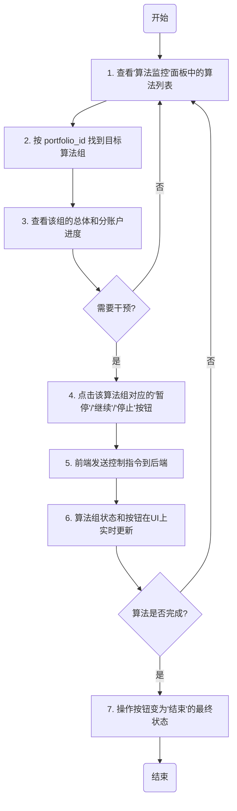

# 期权交易系统Web端 UI/UX 规范

## **引言**

本文档定义了期权交易系统Web端的用户体验(UX)目标、信息架构、用户流程和视觉设计规范。 它的核心目标是为专业的期权交易员，特别是那些追求极致速度和效率的用户，打造一个功能强大、反应迅速且交互清晰的交易平台。 本文档将作为视觉设计和前端开发的基石，确保最终产品具有高度的内聚性和用户中心化的体验。

### **总体UX目标与原则**

#### **目标用户画像**

* **核心用户 (Ryan)**: 一位专业的期权交易员，他追求极致的速度和效率，习惯于处理高密度的信息界面，并严重依赖自定义指令进行快速交易。 他需要系统提供即时反馈，并能让他完全掌控交易的各个环节。

#### **可用性目标**

* **极致的效率**: 所有核心交易工作流，特别是从指令输入到下单确认的流程，其感知速度必须超越现有的桌面应用。
* **清晰直观**: 尽管信息密度高，但界面布局必须清晰，使用户能够毫不费力地在指令区、账户区和监控区之间切换，并快速定位所需信息。 
* **预防错误**: 系统必须提供实时指令解析预览 和全面的下单前确认表格，以最大限度地减少操作失误。
* **易学性**: 对于熟悉现有桌面应用逻辑的用户，新Web界面的学习曲线应尽可能平缓。

#### **设计原则**

1.  **速度至上 (Speed is Paramount)**: 在任何设计决策中，优先考虑性能和响应速度。交互必须是即时的，数据更新无延迟。 
2.  **信息驱动 (Information-Dense, not Cluttered)**: 为专业用户设计，接受高信息密度的界面，但必须通过优秀的布局、分组和视觉层次来确保信息的清晰度和可读性。
3.  **反馈即时 (Immediate Feedback)**: 用户的每一个重要操作，特别是指令输入，都应获得即时的、可视化的系统响应和解析结果。
4.  **安全可靠 (Safety and Reliability)**: 在关键操作（如下单）前提供清晰的预览和确认步骤，建立用户的信任感。 将有问题的账户明确标记并禁用，以防止在不健康的账户上进行操作。
5.  **聚焦工作流 (Workflow-Centric)**: 整个设计应严格遵循交易员的核心工作流：“**1.选择账户 -> 2.输入指令 -> 3.预览风险 -> 4.执行交易**”。
    * **明确的起点**: 用户登录后，其名下的虚拟账户列表会加载，但**默认不勾选**。这强制用户在操作前首先明确意图范围，是一个内置的风险控制步骤。
    * **高效的操作模式**: 设计应提供“一键全选”等便捷功能，以适应交易员在大部分情况下需要操作所有健康账户的习惯。特定操作时，他们也可以快速地取消勾选个别账户。

## **2. 信息架构 (Information Architecture)**

### **核心理念**
放弃固定的三栏布局，采用一个灵活的、可扩展的“模块化面板”架构。这允许我们在当前MVP（最小可行产品）范围内实现核心功能，并为未来无缝添加新功能面板（如持仓、成交历史等）预留空间。

### **站点地图 / 屏幕清单 (Site Map / Screen Inventory)**

应用的核心是一个单页仪表盘，其内部由一系列可独立或堆叠的面板组成。

```mermaid
graph TD
    A[用户登录] --> B(主仪表盘 Dashboard);
    
    subgraph "主仪表盘 (可扩展的面板容器)"
        direction TB
        subgraph "MVP 范围内的核心面板"
            C(指令下单面板)
            D(虚拟账户监控面板)
            E(算法监控面板)
        end
        subgraph "未来可扩展面板 (示例)"
            H(持仓统计面板)
            I(成交历史面板)
            J(风险分析面板)
        end
    end

    B --> C & D & E

    C --> F{触发下单};
    F --> G[综合预览表格 (内嵌)];
    G --> C;
```

### **导航结构 (Navigation Structure)**

* **主导航**: 不适用。用户的所有核心操作都在单一的**主仪表盘**内完成。
* **面板式交互**: 用户通过滚动或在不同的功能面板之间进行交互，而不是在“页面”之间跳转。
    1.  **扩展性**: 未来可以轻松地在堆叠布局中添加新的功能面板，而无需重新设计整个界面。
    2.  **专注性**: 用户可以将注意力集中在当前任务相关的面板上。
    3.  **灵活性 (远期)**: 未来版本可以考虑允许用户自定义面板的顺序或折叠/展开面板，以适应个人工作习惯。

## **3. 用户流程 (User Flows)**

### **流程 1: 指令下单流程 (Instruction Order Placement Flow)**

**用户目标**: 交易员希望使用自定义的快捷指令，在多个选定账户上快速、准确地生成并提交期权订单，同时能在下单前于主界面固定位置清晰地预览所有订单细节和风险。

**入口点**: 主仪表盘的“指令下单面板”和“虚拟账户监控面板”。

**成功标准**: 用户成功提交一个或多个符合其指令意图的算法单到后端，并在界面上得到明确的成功反馈（如桌面通知）。

#### **流程图 (无弹窗版)**

```mermaid
graph TD
    A(开始) --> B[1. 在'虚拟账户监控'面板勾选一个或多个账户];
    B --> C{账户是否可用?};
    C -->|否 (账户置灰)| B;
    C -->|是| D[2. 在'指令下单'面板的输入框中键入指令];
    D --> E[3. 界面实时显示解析后的标准化指令格式];
    E --> F{指令是否完整且有效?};
    F -->|否| D;
    F -->|是| G[4. '指令下单'面板内动态生成并展示'综合预览表格'];
    G --> H[5. 用户滚动或聚焦至预览表格, 审查所有细节和风险数据];
    H --> I{用户点击'确认下单'按钮?};
    I -->|否 (修改指令)| D;
    I -->|是| J[6. 前端将指令发送至后端];
    J --> K[7. '算法监控'面板出现新任务, 并触发通知];
    K --> L(结束);
```

### **流程 2: 算法监控与控制流程 (Algorithm Monitoring and Control Flow)**

**用户目标**: 交易员需要实时监控所有算法订单的执行进度，并能对正在运行的算法组进行暂停、继续或停止操作。

**入口点**: 主仪表盘的“算法监控面板”。

**成功标准**: 用户能够成功地对一个算法组执行“暂停”、“继续”或“停止”操作，并且算法监控面板能准确地实时更新该算法组的状态和进度。

#### **流程图**



## **4. 线框图与模型 (Wireframes & Mockups)**

**布局理念**: 采用一个**可定制的、多列的网格布局**。用户可以自由拖拽、拉伸和堆叠三大核心功能面板，并可以将自己最满意的布局方案锁定，以防止误操作。这为专业交易员提供了极致的个性化和操作效率。

#### **默认布局概念**

```
+---------------------------------------------+------------------------------------+
| 左侧面板 (主要操作区)                       | 右侧面板 (主要观察区)              |
+---------------------------------------------+------------------------------------+
|                                             |                                    |
|  +---------------------------------------+  |                                    |
|  | [左上方面板: 虚拟账户监控]            |  |  +-------------------------------+  |
|  |                                         |  |  | [算法监控]                    |  |
|  |  [ ] 全选 [ ] 账户A [ ] 账户B ...      |  |  |                                 |  |
|  |                                         |  |  算法监控表格                 |  |
|  +---------------------------------------+  |  |  [算法组][进度]...[操作]       |  |
|                                             |  |                                 |  |
|  +---------------------------------------+  |  |                                 |  |
|  | [左下面板: 指令下单与预览]            |  |  +-------------------------------+  |
|  |                                         |  |                                    |
|  |  [指令输入框] [执行下单按钮]          |  |                                    |
|  |  +-----------------------------------+  |                                    |
|  |  | 内嵌的综合预览表格                |  |                                    |
|  |  +-----------------------------------+  |                                    |
|  +---------------------------------------+  |                                    |
|                                             |                                    |
+---------------------------------------------+------------------------------------+
```

#### **新增功能需求**
* **面板可定制化**: 所有三个核心面板（账户、指令、算法）都应支持用户通过拖拽调整其在仪表盘上的位置。
* **尺寸可调整**: 每个面板的边缘应支持用户拖动以调整其尺寸。
* **布局锁定**: 提供一个“锁定布局”的开关/按钮，用户可以将当前布局保存并固定，避免意外拖动。

## **5. 组件库 / 设计系统 (Component Library / Design System)**

#### **设计系统方法**
* **基础库**: 采用 **Shadcn/ui**。我们将利用其提供的无样式、功能完整的组件作为起点，来构建符合我们特定视觉风格的界面。
* **布局引擎**: 集成 **`React-Grid-Layout`** 或类似库，以实现用户期望的面板“可拉伸、可拖拽、可锁定”的动态网格布局功能。

#### **核心组件清单**
* `CommandInput` (指令输入框)
* `AccountList` (账户列表)
* `PreviewGrid` (综合预览表格)
* `AlgorithmGrid` (算法监控表格)
* `ActionButtons` (操作按钮)
* `Notification` (通知组件)
* `DashboardPanel` (面板容器)
* **`DashboardGridContainer` (新增)**: 用于管理和呈现所有可拖拽面板的网格布局容器，这是实现新布局的核心。

## **6. 品牌与风格指南 (Branding & Style Guide)**

### **主题策略**
* **MVP核心主题**: 硬核科技 (Hardcore Tech) - 暗色模式 (Dark Mode)。
* **MVP扩展**: 支持在“硬核科技”主题下进行亮色/暗色模式切换。
* **架构设计**: 所有样式变量化，为未来无缝添加“现代极简”和“经典金融”等新主题做好技术储备。

### **色彩规范 (示例：硬核科技 - 暗色模式)**

| 颜色类型 | Hex 色值 (示例) | 用途描述 |
| :--- | :--- | :--- |
| **背景色 (主)** | `#121212` | 界面的最底层背景，深邃的炭黑色 |
| **背景色 (面板)** | `#1E1E1E` | 各功能面板的背景色，与主背景形成细微层次 |
| **边框/分割线** | `#333333` | 用于分隔不同的UI元素和面板 |
| **文本 (主)** | `#E0E0E0` | 主要的文字内容，保证高可读性 |
| **文本 (次要)** | `#888888` | 辅助性文字、标签、占位符等 |
| **主色调 (高亮)** | `#00A8FF` | 用于可交互元素、选中状态、关键数据，体现科技感 |
| **成功/上涨** | `#00B894` | 用于成功提示、盈利数字等积极反馈 |
| **失败/下跌** | `#D63031` | 用于错误提示、亏损数字等警示性反馈 |
| **警告** | `#FFC107` | 用于需要用户注意的非关键性警示 |

### **字体规范**

* **界面字体**: `Inter` 或 `Roboto` - 现代、清晰的无衬线字体，适合UI阅读。
* **数据显示字体**: `Roboto Mono` 或 `Fira Code` - 等宽字体，用于显示数字、代码和需要精确对齐的表格数据，增强专业感和可读性。

## **7. 无障碍设计要求 (Accessibility Requirements)**

### **合规目标**
* **标准**: 我们的目标是达到 **WCAG 2.1 AA** 级别。这是国际公认的Web内容无障碍指南，也是当前行业内应用最广泛的标准。

### **关键要求**

#### **视觉方面**
* **色彩对比度**: 所有文本、图标和重要UI控件的颜色组合，其对比度必须至少达到 **4.5:1**。
* **焦点指示**: 所有可交互的元素在通过键盘获得焦点时，必须有清晰、高可见度的视觉轮廓。
* **文字缩放**: 用户应能够将浏览器或页面的缩放级别提高到200%而不会破坏布局或导致功能不可用。

#### **交互方面**
* **键盘导航**: 整个应用的所有功能必须能够仅通过键盘完成。
* **屏幕阅读器支持**: 所有的UI控件和内容都应有正确的语义化标签和ARIA属性。

#### **内容方面**
* **替代文本**: 所有有实际意义的图标和图片都必须提供简洁明了的替代文本。
* **表单标签**: 所有的输入框都必须有程序化关联的`<label>`标签。

## **8. 响应式策略 (Responsiveness Strategy)**

### **范围定义**
本应用**仅为桌面端设计**。所有设计和开发工作都将围绕标准桌面及笔记本电脑分辨率进行优化。移动电话和平板电脑等非桌面设备不在本次MVP的支持范围内。

### **桌面屏幕尺寸的自适应**
桌面显示器的尺寸范围很广，我们的策略是确保应用能在常见的桌面分辨率（例如，从 `1280px` 宽度到 `1920px+` 的宽屏）下都表现良好。这主要通过**面板内容智能自适应**机制来实现，即面板内的表格、列表等内容会根据用户拖拽调整的面板尺寸，智能地显示或隐藏信息，而不是改变整体页面布局。当组件被拖拉时，它们需要自适应，不可以不显示必要的组件信息。

## **9. 动画与微交互 (Animation & Micro-interactions)**
我们将采用以功能性为导向的微交互，确保动效快速、简洁，旨在提供操作反馈和引导注意力，而不会影响系统性能或打断用户心流。例如：
* **状态过渡**: 平滑的背景色或图标渐变。
* **数据更新**: 更新的数据行短暂高亮。
* **按钮反馈**: 关键按钮点击后显示加载状态。

## **10. 性能考量 (Performance Considerations)**
Web 版本的性能是最高优先级的非功能性需求。

### **性能目标**
* **即时响应**: 用户的任何操作都必须在100毫秒内得到界面的视觉反馈。
* **无延迟数据流**: 来自WebSocket的实时数据必须被立即渲染到界面上，无肉眼可感的延迟。
* **高效渲染**: 即使列表和表格包含数百行数据，界面的滚动和更新也必须保持流畅。

### **关键设计与技术策略**
* **列表虚拟化 (List Virtualization)**: 对于“算法监控”和“虚拟账户监控”这两个可能存在大量数据的面板，必须采用此技术。
* **乐观更新 (Optimistic Updates)**: 对于某些操作（如点击“暂停”），UI可以立即显示更新后的状态，然后等待后端确认。
* **去抖动与节流 (Debouncing & Throttling)**: 用于指令实时解析和高频数据流更新，以保证UI的响应性。
* **清晰的加载状态 (Loading States)**: 任何需要等待后端响应的区域，都必须有明确的加载指示器。

## **11. 后续步骤 (Next Steps)**

### **直接行动项**
1.  **最终审阅**: 请所有项目干系人对这份完整的UI/UX规范进行最终审阅。
2.  **高保真设计**: 设计团队可以根据这份规范，在Figma等专业工具中开始创建高保真的视觉稿。
3.  **技术架构设计**: 将此文档作为关键输入，移交给**系统架构师 (Architect)**，以进行详细的前端技术架构设计。

### **设计交接清单**
* [x] 核心用户流程已文档化
* [x] 组件清单已完成
* [x] 无障碍设计要求已定义
* [x] 响应式策略已明确
* [x] 品牌与风格指南已建立
* [x] 性能目标与策略已设定