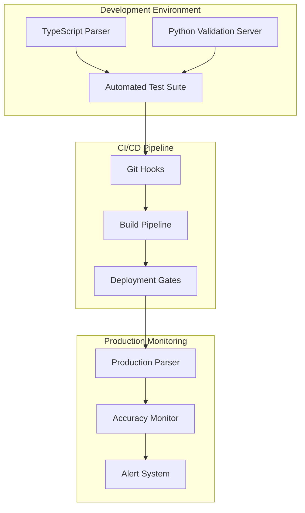

# Parsing Validation Framework: Python-TypeScript Consistency Testing

## Overview

This document specifies a comprehensive validation framework to ensure 100% consistency between the TypeScript instruction parsing implementation and the Python reference implementations. Given the critical nature of financial trading instructions, any parsing discrepancy could result in incorrect trades and financial losses.

## Framework Architecture



## Core Components

### 1. Python Validation Server

#### Flask Application Structure

```python
# validation_server/app.py
from flask import Flask, request, jsonify
from flask_cors import CORS
import time
import traceback
import logging
from typing import Dict, List, Any, Callable

# Import all parser functions
from parsers.vega_parser import parse_vega_instructions
from parsers.delta_parser import (
    parse_single_side_delta_instructions,
    parse_dual_side_delta_instructions,
    parse_fixed_strike_delta_instructions
)
from parsers.clear_parser import parse_clear_strike_option_instructions

app = Flask(__name__)
CORS(app)

# Configure logging
logging.basicConfig(level=logging.INFO)
logger = logging.getLogger(__name__)

class ValidationServer:
    def __init__(self):
        self.parsers: Dict[str, Callable[[str], List[str]]] = {
            'vega': parse_vega_instructions,
            'single_delta': parse_single_side_delta_instructions,
            'dual_delta': parse_dual_side_delta_instructions,
            'fixed_delta': parse_fixed_strike_delta_instructions,
            'clear': parse_clear_strike_option_instructions
        }
        
        self.stats = {
            'total_requests': 0,
            'successful_parses': 0,
            'failed_parses': 0,
            'average_execution_time': 0
        }
    
    def validate_single_instruction(self, instruction: str, parser_type: str) -> Dict[str, Any]:
        """Validate a single instruction against Python parser"""
        start_time = time.time()
        
        try:
            if parser_type not in self.parsers:
                return {
                    'success': False,
                    'result': [],
                    'errors': [f'Unknown parser type: {parser_type}'],
                    'execution_time_ms': 0,
                    'parser_type': parser_type,
                    'instruction': instruction
                }
            
            parser = self.parsers[parser_type]
            result = parser(instruction)
            execution_time = (time.time() - start_time) * 1000
            
            # Update statistics
            self.stats['total_requests'] += 1
            self.stats['successful_parses'] += 1
            self._update_average_time(execution_time)
            
            logger.info(f"Successful parse: {parser_type} - {instruction[:50]}...")
            
            return {
                'success': True,
                'result': result,
                'errors': [],
                'execution_time_ms': execution_time,
                'parser_type': parser_type,
                'instruction': instruction
            }
            
        except Exception as e:
            execution_time = (time.time() - start_time) * 1000
            error_msg = str(e)
            traceback_str = traceback.format_exc()
            
            # Update statistics
            self.stats['total_requests'] += 1
            self.stats['failed_parses'] += 1
            
            logger.error(f"Parse failed: {parser_type} - {instruction[:50]}... - {error_msg}")
            
            return {
                'success': False,
                'result': [],
                'errors': [error_msg],
                'traceback': traceback_str,
                'execution_time_ms': execution_time,
                'parser_type': parser_type,
                'instruction': instruction
            }
    
    def validate_batch_instructions(self, batch: List[Dict[str, str]]) -> List[Dict[str, Any]]:
        """Validate multiple instructions in batch"""
        results = []
        for item in batch:
            instruction = item.get('instruction', '')
            parser_type = item.get('parser_type', '')
            result = self.validate_single_instruction(instruction, parser_type)
            results.append(result)
        return results
    
    def _update_average_time(self, execution_time: float) -> None:
        """Update average execution time"""
        total = self.stats['total_requests']
        current_avg = self.stats['average_execution_time']
        self.stats['average_execution_time'] = ((current_avg * (total - 1)) + execution_time) / total

# Global validation server instance
validator = ValidationServer()

@app.route('/health', methods=['GET'])
def health_check():
    """Health check endpoint"""
    return jsonify({
        'status': 'healthy',
        'timestamp': time.time(),
        'stats': validator.stats
    })

@app.route('/validate', methods=['POST'])
def validate_instruction():
    """Single instruction validation endpoint"""
    try:
        data = request.json
        if not data:
            return jsonify({'error': 'No JSON data provided'}), 400
        
        instruction = data.get('instruction')
        parser_type = data.get('parser_type')
        
        if not instruction or not parser_type:
            return jsonify({
                'error': 'Missing required fields: instruction, parser_type'
            }), 400
        
        result = validator.validate_single_instruction(instruction, parser_type)
        return jsonify(result)
        
    except Exception as e:
        logger.error(f"Validation endpoint error: {str(e)}")
        return jsonify({'error': 'Internal server error'}), 500

@app.route('/validate/batch', methods=['POST'])
def validate_batch():
    """Batch instruction validation endpoint"""
    try:
        data = request.json
        if not data or 'instructions' not in data:
            return jsonify({'error': 'Missing instructions array'}), 400
        
        instructions = data['instructions']
        if not isinstance(instructions, list):
            return jsonify({'error': 'Instructions must be an array'}), 400
        
        results = validator.validate_batch_instructions(instructions)
        return jsonify({'results': results})
        
    except Exception as e:
        logger.error(f"Batch validation endpoint error: {str(e)}")
        return jsonify({'error': 'Internal server error'}), 500

@app.route('/parsers', methods=['GET'])
def list_parsers():
    """List available parser types"""
    return jsonify({
        'parsers': list(validator.parsers.keys()),
        'count': len(validator.parsers)
    })

@app.route('/stats', methods=['GET'])
def get_stats():
    """Get validation statistics"""
    return jsonify(validator.stats)

if __name__ == '__main__':
    app.run(host='0.0.0.0', port=5000, debug=False)
```

#### Docker Configuration

```dockerfile
# validation_server/Dockerfile
FROM python:3.10-slim

WORKDIR /app

# Install dependencies
COPY requirements.txt .
RUN pip install --no-cache-dir -r requirements.txt

# Copy application code
COPY . .

# Expose port
EXPOSE 5000

# Run application
CMD ["python", "app.py"]
```

```yaml
# validation_server/requirements.txt
Flask==2.3.3
Flask-CORS==4.0.0
gunicorn==21.2.0
```

### 2. TypeScript Validation Client

```typescript
// src/validation/python-validator.ts
export interface ValidationRequest {
  instruction: string;
  parser_type: 'vega' | 'single_delta' | 'dual_delta' | 'fixed_delta' | 'clear';
}

export interface ValidationResponse {
  success: boolean;
  result: string[];
  errors: string[];
  execution_time_ms: number;
  parser_type: string;
  instruction: string;
  traceback?: string;
}

export interface BatchValidationRequest {
  instructions: ValidationRequest[];
}

export interface BatchValidationResponse {
  results: ValidationResponse[];
}

export interface ConsistencyResult {
  isConsistent: boolean;
  typescriptResult: string[];
  pythonResult: string[];
  instruction: string;
  parserType: string;
  differences?: string[];
  executionTimes: {
    typescript: number;
    python: number;
  };
}

export class PythonValidator {
  private static readonly DEFAULT_URL = 'http://localhost:5000';
  private baseUrl: string;
  private timeout: number;

  constructor(baseUrl?: string, timeout: number = 10000) {
    this.baseUrl = baseUrl || PythonValidator.DEFAULT_URL;
    this.timeout = timeout;
  }

  /**
   * Validate single instruction against Python parser
   */
  async validateInstruction(
    instruction: string,
    parserType: ValidationRequest['parser_type']
  ): Promise<ValidationResponse> {
    const controller = new AbortController();
    const timeoutId = setTimeout(() => controller.abort(), this.timeout);

    try {
      const response = await fetch(`${this.baseUrl}/validate`, {
        method: 'POST',
        headers: { 'Content-Type': 'application/json' },
        body: JSON.stringify({
          instruction,
          parser_type: parserType
        }),
        signal: controller.signal
      });

      clearTimeout(timeoutId);

      if (!response.ok) {
        throw new Error(`HTTP ${response.status}: ${response.statusText}`);
      }

      return await response.json();
    } catch (error) {
      clearTimeout(timeoutId);
      throw error;
    }
  }

  /**
   * Validate multiple instructions in batch
   */
  async validateBatch(requests: ValidationRequest[]): Promise<ValidationResponse[]> {
    const controller = new AbortController();
    const timeoutId = setTimeout(() => controller.abort(), this.timeout * 2);

    try {
      const response = await fetch(`${this.baseUrl}/validate/batch`, {
        method: 'POST',
        headers: { 'Content-Type': 'application/json' },
        body: JSON.stringify({ instructions: requests }),
        signal: controller.signal
      });

      clearTimeout(timeoutId);

      if (!response.ok) {
        throw new Error(`HTTP ${response.status}: ${response.statusText}`);
      }

      const data: BatchValidationResponse = await response.json();
      return data.results;
    } catch (error) {
      clearTimeout(timeoutId);
      throw error;
    }
  }

  /**
   * Compare TypeScript and Python parser results
   */
  async compareResults(
    instruction: string,
    parserType: ValidationRequest['parser_type'],
    typescriptResult: string[],
    typescriptExecutionTime: number
  ): Promise<ConsistencyResult> {
    try {
      const pythonResult = await this.validateInstruction(instruction, parserType);

      if (!pythonResult.success) {
        return {
          isConsistent: false,
          typescriptResult,
          pythonResult: [],
          instruction,
          parserType,
          differences: pythonResult.errors,
          executionTimes: {
            typescript: typescriptExecutionTime,
            python: pythonResult.execution_time_ms
          }
        };
      }

      // Sort arrays for comparison to ignore order differences
      const sortedTypescript = [...typescriptResult].sort();
      const sortedPython = [...pythonResult.result].sort();
      const isConsistent = JSON.stringify(sortedTypescript) === JSON.stringify(sortedPython);

      const result: ConsistencyResult = {
        isConsistent,
        typescriptResult,
        pythonResult: pythonResult.result,
        instruction,
        parserType,
        executionTimes: {
          typescript: typescriptExecutionTime,
          python: pythonResult.execution_time_ms
        }
      };

      if (!isConsistent) {
        result.differences = [
          `TypeScript output: ${JSON.stringify(sortedTypescript)}`,
          `Python output: ${JSON.stringify(sortedPython)}`
        ];
      }

      return result;
    } catch (error) {
      return {
        isConsistent: false,
        typescriptResult,
        pythonResult: [],
        instruction,
        parserType,
        differences: [`Validation error: ${error}`],
        executionTimes: {
          typescript: typescriptExecutionTime,
          python: 0
        }
      };
    }
  }

  /**
   * Check if validation server is healthy
   */
  async healthCheck(): Promise<boolean> {
    try {
      const response = await fetch(`${this.baseUrl}/health`, { method: 'GET' });
      return response.ok;
    } catch {
      return false;
    }
  }

  /**
   * Get validation server statistics
   */
  async getStats(): Promise<any> {
    const response = await fetch(`${this.baseUrl}/stats`, { method: 'GET' });
    return response.json();
  }
}

// Singleton instance for global use
export const pythonValidator = new PythonValidator();
```

### 3. Automated Test Suite

```typescript
// tests/consistency/parser-consistency.test.ts
import { parseInstructionToStrings } from '../../src/instruction-parser';
import { pythonValidator, ValidationRequest } from '../../src/validation/python-validator';
import testCases from '../../docs/instruction_parsing_test_datasets.json';

describe('Parser Consistency Tests', () => {
  let serverHealthy = false;

  beforeAll(async () => {
    // Check if Python validation server is running
    serverHealthy = await pythonValidator.healthCheck();
    if (!serverHealthy) {
      console.warn('Python validation server not available - skipping consistency tests');
    }
  });

  describe('Original Test Cases Consistency', () => {
    const parserTypes: Array<{
      name: string;
      type: ValidationRequest['parser_type'];
      cases: Record<string, string[]>;
    }> = [
      {
        name: 'Vega Instructions',
        type: 'vega',
        cases: testCases.vegaInstructions.originalTestCases
      },
      {
        name: 'Single-Side Delta',
        type: 'single_delta',
        cases: testCases.singleSideDelta.originalTestCases
      },
      {
        name: 'Dual-Side Delta',
        type: 'dual_delta',
        cases: testCases.dualSideDelta.originalTestCases
      },
      {
        name: 'Fixed Strike Delta',
        type: 'fixed_delta',
        cases: testCases.fixedStrikeDelta.originalTestCases
      },
      {
        name: 'Clear Positions',
        type: 'clear',
        cases: testCases.clearPositions.originalTestCases
      }
    ];

    parserTypes.forEach(({ name, type, cases }) => {
      describe(name, () => {
        Object.entries(cases).forEach(([instruction, expectedResult]) => {
          test(`should parse "${instruction}" consistently with Python`, async () => {
            if (!serverHealthy) {
              pending('Python validation server not available');
              return;
            }

            const startTime = performance.now();
            const typescriptResult = parseInstructionToStrings(instruction, type);
            const executionTime = performance.now() - startTime;

            const consistency = await pythonValidator.compareResults(
              instruction,
              type,
              typescriptResult,
              executionTime
            );

            expect(consistency.isConsistent).toBe(true);
            if (!consistency.isConsistent) {
              console.error('Consistency check failed:', {
                instruction,
                typescript: consistency.typescriptResult,
                python: consistency.pythonResult,
                differences: consistency.differences
              });
            }

            // Also verify against expected result
            expect(typescriptResult.sort()).toEqual(expectedResult.sort());
          });
        });
      });
    });
  });

  describe('Edge Cases Consistency', () => {
    const edgeCaseTypes = [
      { type: 'vega' as const, cases: testCases.vegaInstructions.additionalEdgeCases },
      { type: 'single_delta' as const, cases: testCases.singleSideDelta.additionalEdgeCases },
      { type: 'dual_delta' as const, cases: testCases.dualSideDelta.additionalEdgeCases },
      { type: 'fixed_delta' as const, cases: testCases.fixedStrikeDelta.additionalEdgeCases },
      { type: 'clear' as const, cases: testCases.clearPositions.additionalEdgeCases }
    ];

    edgeCaseTypes.forEach(({ type, cases }) => {
      Object.entries(cases).forEach(([instruction, expectedResult]) => {
        test(`should handle edge case "${instruction}" consistently`, async () => {
          if (!serverHealthy) {
            pending('Python validation server not available');
            return;
          }

          const startTime = performance.now();
          const typescriptResult = parseInstructionToStrings(instruction, type);
          const executionTime = performance.now() - startTime;

          const consistency = await pythonValidator.compareResults(
            instruction,
            type,
            typescriptResult,
            executionTime
          );

          expect(consistency.isConsistent).toBe(true);
          expect(typescriptResult.sort()).toEqual(expectedResult.sort());
        });
      });
    });
  });

  describe('Performance Consistency', () => {
    test('TypeScript parser should perform within acceptable range of Python', async () => {
      if (!serverHealthy) {
        pending('Python validation server not available');
        return;
      }

      const testInstruction = "双卖 500 当月 万1 的v";
      const iterations = 100;
      
      // Warm up
      for (let i = 0; i < 10; i++) {
        parseInstructionToStrings(testInstruction, 'vega');
        await pythonValidator.validateInstruction(testInstruction, 'vega');
      }

      // Measure TypeScript performance
      const tsStartTime = performance.now();
      for (let i = 0; i < iterations; i++) {
        parseInstructionToStrings(testInstruction, 'vega');
      }
      const tsAvgTime = (performance.now() - tsStartTime) / iterations;

      // Measure Python performance (batch for efficiency)
      const requests = Array(iterations).fill({
        instruction: testInstruction,
        parser_type: 'vega'
      });
      
      const pyStartTime = performance.now();
      const results = await pythonValidator.validateBatch(requests);
      const pyAvgTime = (performance.now() - pyStartTime) / iterations;

      console.log(`Performance comparison:
        TypeScript avg: ${tsAvgTime.toFixed(2)}ms
        Python avg: ${pyAvgTime.toFixed(2)}ms
        Ratio: ${(tsAvgTime / pyAvgTime).toFixed(2)}x`);

      // TypeScript should be within 5x of Python performance
      expect(tsAvgTime).toBeLessThan(pyAvgTime * 5);
      
      // Both should be under 100ms target
      expect(tsAvgTime).toBeLessThan(100);
    });
  });

  describe('Error Handling Consistency', () => {
    const errorScenarios = [
      { instruction: "500 买 万1 的c", type: 'vega' as const, description: "Missing 双买/双卖 action" },
      { instruction: "双买 500 万1", type: 'vega' as const, description: "Missing 的v indicator" },
      { instruction: "买 万1 的c", type: 'single_delta' as const, description: "Missing target" },
      { instruction: "500 买 万1", type: 'single_delta' as const, description: "Missing 的c/p indicator" }
    ];

    errorScenarios.forEach(({ instruction, type, description }) => {
      test(`should handle error "${description}" consistently`, async () => {
        if (!serverHealthy) {
          pending('Python validation server not available');
          return;
        }

        let typescriptError: string | null = null;
        try {
          parseInstructionToStrings(instruction, type);
        } catch (error) {
          typescriptError = error instanceof Error ? error.message : String(error);
        }

        const pythonResult = await pythonValidator.validateInstruction(instruction, type);

        // Both should fail
        expect(typescriptError).not.toBeNull();
        expect(pythonResult.success).toBe(false);
        expect(pythonResult.errors.length).toBeGreaterThan(0);
      });
    });
  });
});
```

### 4. CI/CD Integration

#### Pre-commit Hook

```bash
#!/bin/bash
# .git/hooks/pre-commit

echo "Running instruction parser consistency checks..."

# Start Python validation server if not running
if ! curl -s http://localhost:5000/health > /dev/null; then
    echo "Starting Python validation server..."
    cd validation_server && python app.py &
    SERVER_PID=$!
    sleep 5
    cd ..
fi

# Run consistency tests
npm run test:consistency

TEST_EXIT_CODE=$?

# Stop server if we started it
if [ ! -z "$SERVER_PID" ]; then
    kill $SERVER_PID
fi

if [ $TEST_EXIT_CODE -ne 0 ]; then
    echo "❌ Consistency tests failed. Commit rejected."
    exit 1
fi

echo "✅ All consistency tests passed."
exit 0
```

#### GitHub Actions Workflow

```yaml
# .github/workflows/parser-validation.yml
name: Instruction Parser Validation

on:
  push:
    branches: [ main, develop ]
  pull_request:
    branches: [ main ]

jobs:
  validation:
    runs-on: ubuntu-latest
    
    services:
      python-validator:
        image: python:3.10-slim
        ports:
          - 5000:5000
        options: >-
          --health-cmd "curl -f http://localhost:5000/health || exit 1"
          --health-interval 30s
          --health-timeout 10s
          --health-retries 5

    steps:
    - uses: actions/checkout@v3
    
    - name: Setup Node.js
      uses: actions/setup-node@v3
      with:
        node-version: '18'
        cache: 'npm'
    
    - name: Setup Python
      uses: actions/setup-python@v4
      with:
        python-version: '3.10'
    
    - name: Install Node dependencies
      run: npm ci
    
    - name: Install Python dependencies
      run: |
        cd validation_server
        pip install -r requirements.txt
    
    - name: Start Python validation server
      run: |
        cd validation_server
        python app.py &
        sleep 10
    
    - name: Wait for validation server
      run: |
        timeout 60 bash -c 'until curl -f http://localhost:5000/health; do sleep 2; done'
    
    - name: Run TypeScript tests
      run: npm run test
    
    - name: Run consistency tests
      run: npm run test:consistency
    
    - name: Run performance tests
      run: npm run test:performance
    
    - name: Generate consistency report
      run: npm run test:consistency:report
    
    - name: Upload test results
      uses: actions/upload-artifact@v3
      if: always()
      with:
        name: test-results
        path: |
          test-results/
          coverage/
```

### 5. Production Monitoring

```typescript
// src/monitoring/accuracy-monitor.ts
export interface ParseAccuracyMetric {
  instruction: string;
  parserType: string;
  isConsistent: boolean;
  timestamp: number;
  executionTime: number;
  userId?: string;
}

export class ProductionAccuracyMonitor {
  private metrics: ParseAccuracyMetric[] = [];
  private validator: PythonValidator;
  private samplingRate: number;

  constructor(samplingRate: number = 0.1) {
    this.validator = new PythonValidator(process.env.VALIDATION_SERVER_URL);
    this.samplingRate = samplingRate;
  }

  /**
   * Monitor parsing accuracy in production
   */
  async monitorParsing(
    instruction: string,
    parserType: ValidationRequest['parser_type'],
    typescriptResult: string[],
    executionTime: number,
    userId?: string
  ): Promise<void> {
    // Sample requests to avoid overloading validation server
    if (Math.random() > this.samplingRate) {
      return;
    }

    try {
      const consistency = await this.validator.compareResults(
        instruction,
        parserType,
        typescriptResult,
        executionTime
      );

      const metric: ParseAccuracyMetric = {
        instruction,
        parserType,
        isConsistent: consistency.isConsistent,
        timestamp: Date.now(),
        executionTime,
        userId
      };

      this.metrics.push(metric);

      // Alert on inconsistency
      if (!consistency.isConsistent) {
        this.alertOnInconsistency(metric, consistency);
      }

      // Clean old metrics (keep last 1000)
      if (this.metrics.length > 1000) {
        this.metrics = this.metrics.slice(-1000);
      }

    } catch (error) {
      console.error('Production monitoring error:', error);
    }
  }

  private alertOnInconsistency(
    metric: ParseAccuracyMetric,
    consistency: ConsistencyResult
  ): void {
    const alert = {
      level: 'CRITICAL',
      message: 'Instruction parsing inconsistency detected',
      details: {
        instruction: metric.instruction,
        parserType: metric.parserType,
        timestamp: metric.timestamp,
        typescriptResult: consistency.typescriptResult,
        pythonResult: consistency.pythonResult,
        differences: consistency.differences
      }
    };

    // Send to monitoring system (Datadog, New Relic, etc.)
    this.sendAlert(alert);
  }

  private sendAlert(alert: any): void {
    // Implementation depends on monitoring system
    console.error('PARSING INCONSISTENCY ALERT:', alert);
    
    // Example: Send to external monitoring service
    if (process.env.MONITORING_WEBHOOK_URL) {
      fetch(process.env.MONITORING_WEBHOOK_URL, {
        method: 'POST',
        headers: { 'Content-Type': 'application/json' },
        body: JSON.stringify(alert)
      }).catch(console.error);
    }
  }

  /**
   * Get accuracy statistics
   */
  getAccuracyStats(): {
    totalSamples: number;
    consistentParses: number;
    accuracyRate: number;
    recentInconsistencies: ParseAccuracyMetric[];
  } {
    const recentCutoff = Date.now() - (24 * 60 * 60 * 1000); // 24 hours
    const recentMetrics = this.metrics.filter(m => m.timestamp > recentCutoff);
    
    const consistentParses = recentMetrics.filter(m => m.isConsistent).length;
    const accuracyRate = recentMetrics.length > 0 ? consistentParses / recentMetrics.length : 1;
    
    return {
      totalSamples: recentMetrics.length,
      consistentParses,
      accuracyRate,
      recentInconsistencies: recentMetrics.filter(m => !m.isConsistent)
    };
  }
}

// Global monitor instance
export const accuracyMonitor = new ProductionAccuracyMonitor();
```

## Golden Dataset Management

### Golden Test Case Generator

```typescript
// tools/golden-dataset-generator.ts
import { parseInstructionToStrings } from '../src/instruction-parser';
import { pythonValidator } from '../src/validation/python-validator';
import testCases from '../docs/instruction_parsing_test_datasets.json';
import fs from 'fs/promises';

interface GoldenTestCase {
  instruction: string;
  parserType: string;
  expectedResult: string[];
  pythonResult: string[];
  typescriptResult: string[];
  isConsistent: boolean;
  metadata: {
    generatedAt: number;
    pythonExecutionTime: number;
    typescriptExecutionTime: number;
    difficulty: 'basic' | 'intermediate' | 'advanced';
    category: string;
  };
}

export class GoldenDatasetGenerator {
  /**
   * Generate comprehensive golden dataset
   */
  async generateGoldenDataset(): Promise<GoldenTestCase[]> {
    const goldenCases: GoldenTestCase[] = [];

    // Process all test case categories
    const categories = [
      { name: 'vega', type: 'vega' as const, cases: testCases.vegaInstructions },
      { name: 'single_delta', type: 'single_delta' as const, cases: testCases.singleSideDelta },
      { name: 'dual_delta', type: 'dual_delta' as const, cases: testCases.dualSideDelta },
      { name: 'fixed_delta', type: 'fixed_delta' as const, cases: testCases.fixedStrikeDelta },
      { name: 'clear', type: 'clear' as const, cases: testCases.clearPositions }
    ];

    for (const category of categories) {
      // Process original test cases
      for (const [instruction, expectedResult] of Object.entries(category.cases.originalTestCases)) {
        const goldenCase = await this.processTestCase(
          instruction,
          category.type,
          expectedResult,
          'basic',
          category.name
        );
        goldenCases.push(goldenCase);
      }

      // Process additional edge cases
      for (const [instruction, expectedResult] of Object.entries(category.cases.additionalEdgeCases)) {
        const goldenCase = await this.processTestCase(
          instruction,
          category.type,
          expectedResult,
          'advanced',
          category.name + '_edge'
        );
        goldenCases.push(goldenCase);
      }
    }

    return goldenCases;
  }

  private async processTestCase(
    instruction: string,
    parserType: any,
    expectedResult: string[],
    difficulty: 'basic' | 'intermediate' | 'advanced',
    category: string
  ): Promise<GoldenTestCase> {
    // Get TypeScript result
    const tsStartTime = performance.now();
    const typescriptResult = parseInstructionToStrings(instruction, parserType);
    const tsExecutionTime = performance.now() - tsStartTime;

    // Get Python result
    const pythonResponse = await pythonValidator.validateInstruction(instruction, parserType);
    const pythonResult = pythonResponse.success ? pythonResponse.result : [];

    // Check consistency
    const isConsistent = JSON.stringify(typescriptResult.sort()) === 
                        JSON.stringify(pythonResult.sort());

    return {
      instruction,
      parserType,
      expectedResult,
      pythonResult,
      typescriptResult,
      isConsistent,
      metadata: {
        generatedAt: Date.now(),
        pythonExecutionTime: pythonResponse.execution_time_ms,
        typescriptExecutionTime: tsExecutionTime,
        difficulty,
        category
      }
    };
  }

  /**
   * Save golden dataset to file
   */
  async saveGoldenDataset(dataset: GoldenTestCase[], filePath: string): Promise<void> {
    const output = {
      metadata: {
        generatedAt: Date.now(),
        totalCases: dataset.length,
        consistentCases: dataset.filter(c => c.isConsistent).length,
        inconsistentCases: dataset.filter(c => !c.isConsistent).length,
        categories: [...new Set(dataset.map(c => c.metadata.category))]
      },
      testCases: dataset
    };

    await fs.writeFile(filePath, JSON.stringify(output, null, 2));
  }

  /**
   * Validate existing golden dataset
   */
  async validateGoldenDataset(filePath: string): Promise<{
    totalCases: number;
    passedCases: number;
    failedCases: GoldenTestCase[];
  }> {
    const content = await fs.readFile(filePath, 'utf-8');
    const dataset = JSON.parse(content);
    
    const failedCases: GoldenTestCase[] = [];
    let passedCases = 0;

    for (const testCase of dataset.testCases) {
      try {
        const result = parseInstructionToStrings(testCase.instruction, testCase.parserType);
        const isConsistent = JSON.stringify(result.sort()) === 
                            JSON.stringify(testCase.expectedResult.sort());
        
        if (isConsistent) {
          passedCases++;
        } else {
          failedCases.push({
            ...testCase,
            typescriptResult: result,
            isConsistent: false
          });
        }
      } catch (error) {
        failedCases.push({
          ...testCase,
          typescriptResult: [`Error: ${error}`],
          isConsistent: false
        });
      }
    }

    return {
      totalCases: dataset.testCases.length,
      passedCases,
      failedCases
    };
  }
}

// CLI tool for generating golden dataset
if (require.main === module) {
  const generator = new GoldenDatasetGenerator();
  
  generator.generateGoldenDataset()
    .then(dataset => generator.saveGoldenDataset(dataset, 'golden-dataset.json'))
    .then(() => console.log('Golden dataset generated successfully'))
    .catch(console.error);
}
```

## Deployment and Operations

### Docker Compose for Development

```yaml
# docker-compose.yml
version: '3.8'

services:
  python-validator:
    build: ./validation_server
    ports:
      - "5000:5000"
    environment:
      - FLASK_ENV=development
    volumes:
      - ./docs/appendices/instructions:/app/parsers
    healthcheck:
      test: ["CMD", "curl", "-f", "http://localhost:5000/health"]
      interval: 30s
      timeout: 10s
      retries: 3

  web-app:
    build: .
    ports:
      - "3000:3000"
    environment:
      - VALIDATION_SERVER_URL=http://python-validator:5000
    depends_on:
      - python-validator
    volumes:
      - .:/app
      - /app/node_modules

  test-runner:
    build: .
    command: npm run test:consistency:watch
    environment:
      - VALIDATION_SERVER_URL=http://python-validator:5000
    depends_on:
      - python-validator
    volumes:
      - .:/app
      - /app/node_modules
```

### Package.json Scripts

```json
{
  "scripts": {
    "test": "jest",
    "test:consistency": "jest --testPathPattern=consistency",
    "test:consistency:watch": "jest --testPathPattern=consistency --watch",
    "test:performance": "jest --testPathPattern=performance",
    "test:consistency:report": "jest --testPathPattern=consistency --reporters=default --reporters=jest-html-reporters",
    "validation:server": "cd validation_server && python app.py",
    "validation:golden": "ts-node tools/golden-dataset-generator.ts",
    "validation:check": "ts-node tools/validation-checker.ts"
  }
}
```

## Success Metrics

### Acceptance Criteria

- **100% Consistency**: All test cases must produce identical results between TypeScript and Python
- **Performance Target**: TypeScript parsing must complete within 100ms for all instructions
- **Coverage Requirement**: Test suite must cover all 85+ test cases plus edge cases
- **Error Handling**: Error scenarios must be handled consistently between implementations
- **CI/CD Integration**: All consistency tests must pass before deployment

### Monitoring KPIs

- **Accuracy Rate**: % of production parses that are consistent (target: >99.9%)
- **Response Time**: Average parsing time (target: <50ms)
- **Error Rate**: % of parsing failures (target: <0.1%)
- **Coverage**: % of instruction patterns tested (target: 100%)

This validation framework ensures the TypeScript instruction parsing implementation maintains perfect compatibility with the Python reference implementations, providing the confidence needed for a critical financial trading system.